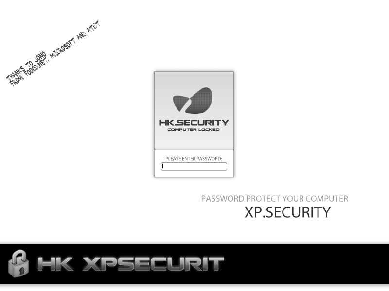



## HK's XPsecurity\. BETA 6\. See screenshot\.

### Description

This litle system tool locks up your system. Try it but remember to open project1 in the folder "options" to set a password ;) Not much to say... ehm... thanks to Microsoft and At&amp;t... and of corse Jono from Foood.net!

Some features:

+ Voice Alarm.

+ E-mail Alarm.

+ Password Encryption.

+ Simple lock-down.

Other Features NOT by me:

+ The encryption

+ Fade Effect.

WILL ONLY WORK ON XP PRO, OR SYSTEMS WITH TASKKILL.EXE. I'm not allowed to "give it away" thanks to microsoft...

PLEASE REPORT BUGS!! THIS IS WHY I UPLOADED THIS CODE ;)
 
### More Info
 

             |
---                |---
**Submitted On**   |2005-05-01 15:44:34
**By**             |[Mickie  Poulsen](https://github.com/Planet-Source-Code/PSCIndex/blob/master/ByAuthor/mickie-poulsen.md)
**Level**          |Intermediate
**User Rating**    |5.0 (10 globes from 2 users)
**Compatibility**  |VB 4\.0 \(32\-bit\), VB 5\.0, VB 6\.0
**Category**       |[Complete Applications](https://github.com/Planet-Source-Code/PSCIndex/blob/master/ByCategory/complete-applications__1-27.md)
**World**          |[Visual Basic](https://github.com/Planet-Source-Code/PSCIndex/blob/master/ByWorld/visual-basic.md)
**Archive File**   |[HK's\_XPsec189573612005\.zip](https://github.com/Planet-Source-Code/mickie-poulsen-hk-s-xpsecurity-beta-6-see-screenshot__1-60855/archive/master.zip)

